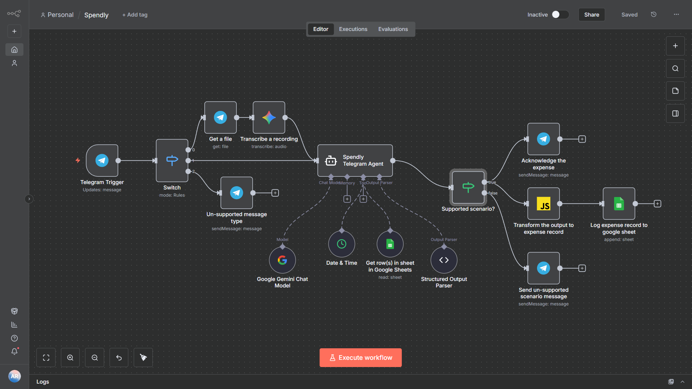

# 📱 Spendly – AI-Powered Telegram Expense Tracker

A smart, lightweight, conversational expense-tracking system built using **n8n**, **Google Gemini**, and **Google Sheets**.

Spendly lets users log expenses naturally through **Telegram messages or voice notes**, while an AI agent extracts structured financial data and stores it automatically.

---

## 🔍 Overview

Spendly turns simple Telegram messages like:

> "Paid 12€ for coffee today ☕"

into structured JSON and logs the expense into Google Sheets — instantly and automatically.

The system combines:
- 💬 Friendly user interaction
- 📋 Strict structured parsing
- ⚙️ Automation-first architecture
- 🧠 Robust LLM-based understanding

This makes Spendly both **simple for users** and **powerful for developers**.

---

## 🚀 Features

### 🗣 Natural Chat Input
Users simply text or send voice messages describing their expenses. No app, no forms.

### 🎧 Voice Support (AI Transcription)
Voice notes are downloaded from Telegram, converted to binary, and transcribed using **Gemini 2.5 Flash**.

### 🤖 AI Parsing with Strict JSON Outputs
A custom-designed system prompt ensures:
- Reliable extraction of date, amount, description, currency, category
- Strict JSON formatting (enforced via n8n Structured Output Parser)
- Friendly user messages
- Correct handling of "today", "yesterday", etc.

### 📊 Google Sheets Logging
All expenses are appended to a Google Sheet with fields:
- Date
- Amount
- Currency
- Category
- Description
- Message ID
- Chat ID

### 🔁 Modular n8n Workflow
Includes routing logic for:
- Supported vs unsupported content
- Voice messages vs text messages
- Error handling
- Structured output parsing
- Tool access (date, sheet tools)

---

## 🧩 Architecture

### High-level Flow



1. **Telegram Trigger** receives updates.
2. **Switch Node** categorizes messages into:
   - Voice messages
   - Text messages
   - Unsupported files/images
3. **Voice Route**
   - Download audio
   - Transcribe via Gemini
   - Send transcribed text to AI agent
4. **Text Route**
   - Forward raw text to AI agent
5. **Spendly AI Agent** (Gemini Chat Model via LangChain node)
   - Uses the custom system prompt
   - Generates structured JSON
6. **Structured Output Parser**
   - Validates JSON schema
7. **IF Node**
   - If *relevant = true*, continue
   - Else, send fallback message
8. **Transform Node (JS)**
   - Convert parsed JSON into sheet-friendly fields
9. **Google Sheets Append**
   - Logs data
10. **Telegram Acknowledgment**
    - Sends confirmation to the user

---

## 📐 System Prompt (Summary)

Spendly is defined through a strict system prompt ensuring:
- Extraction of date, amount, category, description
- Default to EUR unless otherwise specified
- Use `{{$now}}` or `{{$now - 1 day}}` for date logic
- Returning only a single JSON object with:
  - `"relevant": true/false`
  - `"expense_record": { ... }`
  - `"message": "..."`
- No additional text or explanations

A complete version is included in the n8n workflow JSON.

---

## 🛠 Tech Stack

| Component | Technology |
|----------|------------|
| Automation Engine | **n8n** |
| LLM Agent | **Google Gemini (PaLM/Gemini LangChain Nodes)** |
| Audio Transcription | **Gemini 2.5 Flash** |
| Data Storage | **Google Sheets API** |
| Messaging Platform | **Telegram Bot API** |
| Output Validation | **n8n Structured Output Parser** |
| Date Handling | **n8n Date & Time Tool** |

---

## 📂 Repository Structure

```
/Spendly
│
├── Spendly.json          # Full n8n workflow export
├── README.md             # Project documentation
└── assets/               # Optional screenshots, pitch deck
```

---

## 📊 Google Sheets Schema

| Field | Description |
|-------|-------------|
| Date | YYYY-MM-DD (AI computed) |
| Amount | Payment amount |
| Currency | Default: EUR |
| Category | Auto-classified |
| Description | Expense summary |
| Message ID | Telegram message ID |
| Chat ID | Telegram sender/chat ID |

---

## 🧪 Example Input & Output

### Input
```
"Bought apples for 4.5 today"
```

### Output (AI)
```json
{
  "relevant": true,
  "expense_record": {
    "date": "2025-11-17",
    "amount": 4.5,
    "currency": "EUR",
    "category": "Groceries",
    "description": "Apples"
  },
  "message": "Got it! Logged your apples purchase for €4.5 🍎"
}
```

---

## ⚙️ Setup Instructions

### 1. Clone the Project
```bash
git clone https://github.com/your-username/Spendly.git
cd Spendly
```

### 2. Import Workflow into n8n
- Open n8n
- Go to **Workflows → Import From File**
- Select `Spendly.json`

### 3. Add Required Credentials
- **Telegram Bot API** - Get your bot token from [BotFather](https://t.me/botfather)
- **Google Sheets OAuth2** - Authenticate with your Google account
- **Google Gemini API Key** - Obtain from [Google AI Studio](https://makersuite.google.com/app/apikey)

### 4. Configure Google Sheets
- Update the **Document ID** and **GID** in the Google Sheets node
- Create a header row with: Date, Amount, Currency, Category, Description, Message ID, Chat ID

### 5. Start Workflow
- Activate the workflow
- Test via Telegram by sending a message to your bot

---

## 📈 Future Enhancements

- ✨ Multi-currency auto conversion
- 📊 Spending insights (weekly/monthly summaries)
- 🎯 Automatic category learning
- 📤 Export to Notion, Airtable, or a database
- 📱 Telegram mini-dashboard
- 🔐 Privacy-focused analytics

---

## 👨‍💻 Author

**Badass Aman**

Building useful agentic AI tools with automation, LLMs, and robotics.

---

## 📝 License

This project is open source and available under the [MIT License](LICENSE).

---

Enjoy Spendly — your funny, friendly, automated finance buddy! 💸🤖
